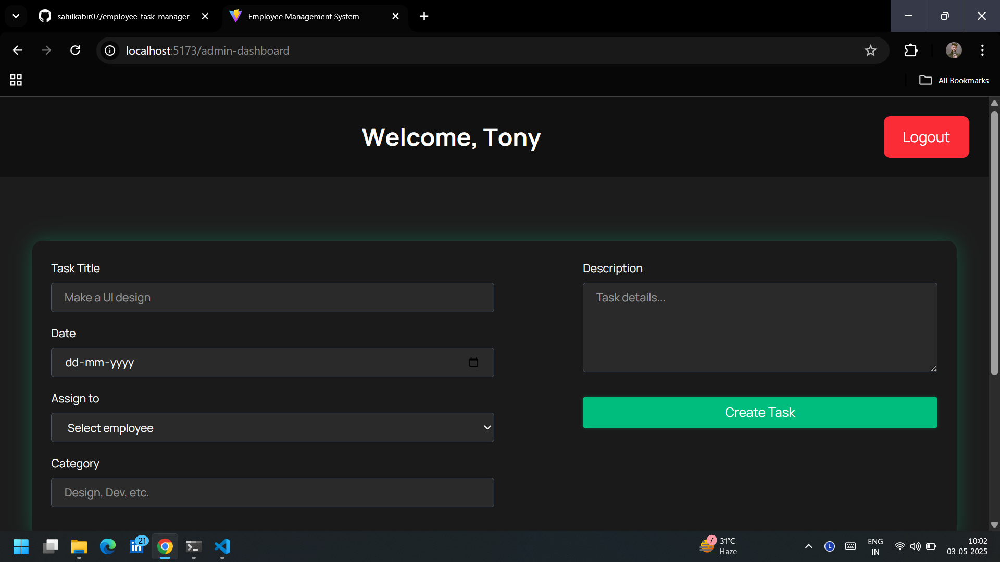
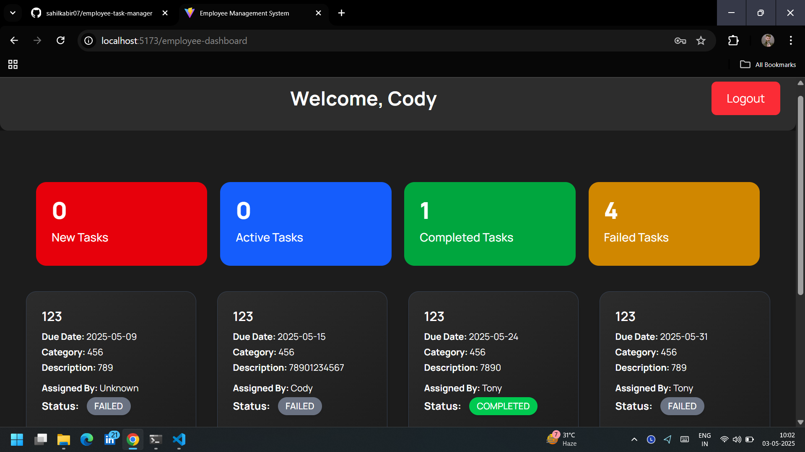
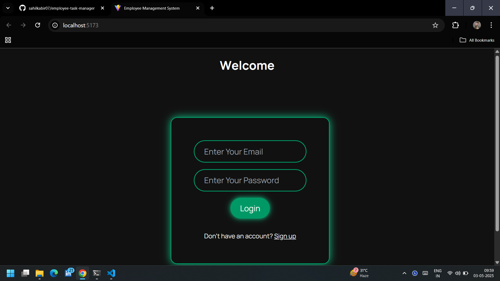
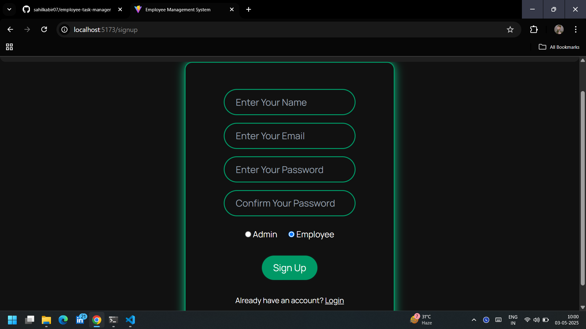

# 🧑‍💼 Employee Task Manager (React)

A React-based employee task management system where users can log in as either an **Admin** or an **Employee**. Admins can assign tasks to specific employees, and employees can view and update their task statuses from a clean, animated dashboard. All task statuses and counts are synced live using localStorage, ensuring both admins and employees have an up-to-date view of progress.

---

## 🖼️ Demo Screenshots

## 📌 Features

### 🔐 Authentication

- Login system using **localStorage** for both Admin and Employees.

### 👨‍💼 Admin Functionality

- View all registered employees.
- Assign tasks to a specific employee by email.
- See live counts of tasks: **New**, **Active**, **Completed**, and **Failed**.
- Task cards show who the task is assigned to, category, deadline, description, and more.

### 👷 Employee Functionality

- View tasks assigned by admin.
- Each task card contains:
  - Task title and category
  - Due date
  - Description
  - Assigned by
  - Status update buttons: **Accept**, **Complete**, **Fail**
- Task status updates reflect **live** in both the employee's and admin's dashboards.

### ⚡ Live Updates

- Task counts dynamically update for both admin and employee after any status change.
- All data is stored and synced using **localStorage**.

### 🎨 UI/UX

- Built with **React**, styled using **Tailwind CSS**.
- Smooth animations with **GSAP**.
- Responsive design for mobile and desktop.

---

## 🛠️ Tech Stack

- **React** (Frontend)
- **Tailwind CSS** (Styling)
- **GSAP** (Animations)
- **localStorage** (Data persistence)
- **React Router DOM** (Routing)

---
